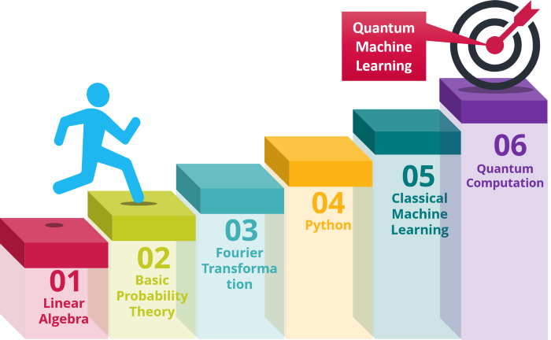

#  Portfolio Project: Brain Cancer Classification with QML <🧠|1>

## 🤖 Intro

>> Our project is a work of three teammates, mentioned at the end of this document.
The approach we went with is a Hybrid Quantum-Classical Model.
Our Solution is Brain Cancer Classification: Classifying 3 Tumor types from MRI pictures using a Hybrid Quantum ConvNet as designed above:

## 👉 Process:
* Retrieve patient MRI image
* Process the image
* predict the result and display it
* Update the database 

## 👉 Environment
This project is interpreted/tested on Ubuntu 20.04.3 LTS using python3 (V 3.8.3)

## 👉 Installation
* Clone this repository: `git clone "https://github.com/ggirlk/Brain_Cancer_Classification.git"`
* Access deployment directory: `cd deployment`
* Run the command: `python manage.py runserver`
* Browse your MRI  and wait for the result

## 👉 Technologies
#### Modeling:
- Pennylane: Quantum Machine Learning Tool.
- Tensorflow: Classical Machine Learning Tool.
- OpenCv (cv2): Image Processing Tool.
- Pandas: Data Manipulation Tool.
- Numpy: Matrix Manipulation Tool
- Scikit-Learn (sklearn): Classical Machine Learning Tool.
- Matplotlib: Plotting Tool.

#### Web App
- Django: Python Web Framework.

## 👉 Bugs
No known bugs at this time. 

## 👉 Resources
[- CNN](https://www.researchgate.net/publication/331540139_A_State-of-the-Art_Survey_on_Deep_Learning_Theory_and_Architectures/figures?lo=1&utm_source=google&utm_medium=organic)
 
[- QCNN](https://arxiv.org/pdf/2009.09423.pdf)
 
[- Pennylane tutorial](https://pennylane.ai/qml/demos/tutorial_quanvolution.html?fbclid=IwAR3Sw-OvDokiY1bzltvyyLHnnlPvlVTnAiwH3HqjTYpLxnjSbibGBfaSmTA)
 
[- Pennylane](https://pennylane.ai/)
 
[- Qiskit](https://qiskit.org/)
 
[- Quantum Computing Concepts – Entanglement](https://www.youtube.com/watch?v=EjdIMBOWCWo)
 

## License
Public Domain. No copy write protection. 

By [Khouloud](https://www.linkedin.com/in/khouloud-alkhammassi-3a9078129), [Ghofrane](https://github.com/anaruzz) and [Mouhamed](https://github.com/medcharfi96) Software engineers at [HolbertonSchool®️](https://www.holbertonschool.com)

